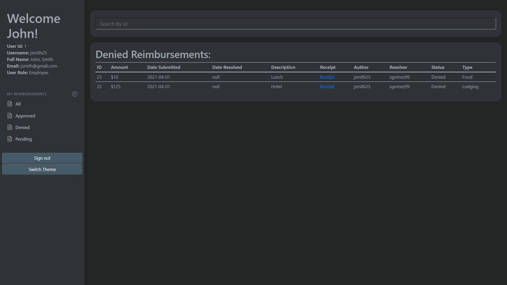
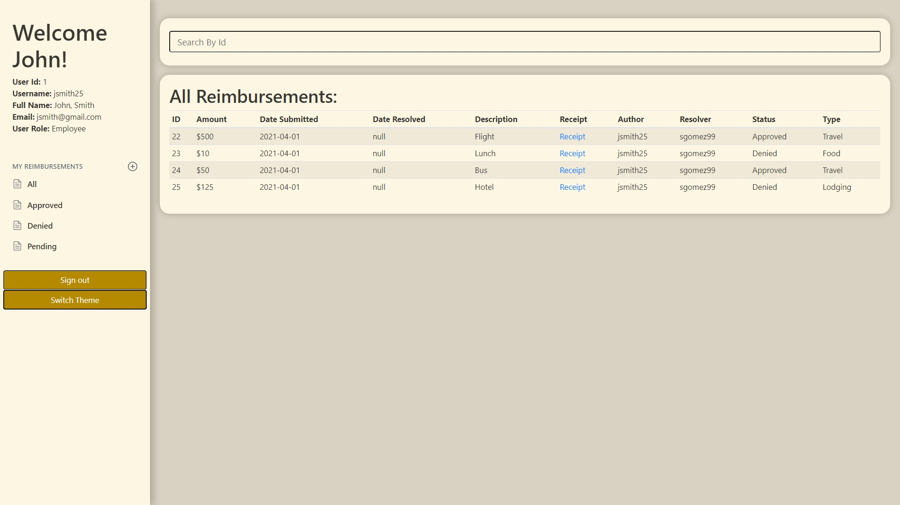

# Expense Reimbursement System

## Project Description
This is a management system that handles company reimbursement requests. There are two account types that are available: Finance Manager (admin) and Employee. An Employee is able to submit a reimbursement and a Finance Manager is able to approve or deny it.

## Technologies Used
- Java
- JavaScript
- HTML
- CSS
- JDBC
- AWS RDS
- PostgreSQL
- Javalin

## Features
 **All Users** 
 - Sign up for a new account
  - Log into accounts

**Employee Account**
 - Submit categorized requests for reimbursements
 - Attach pictures of recepits to rreimbursement equests
 - View all previous reimbursement requests based on their status
 - Filter requests by their id number

**Finance Manager (Admin) Account** 
 - Approve or deny pending reimbursement requests
 - Change the account type of any registered account
- Filter reimbursements by id
- View attached images
 - Sort reimbursements by their status

# To-Do
- Add encryption to passwords before storing them in database
- Add a frame to display pictures, rather than opening them in a new tab
- Ability to update and delete account

## Getting Started

    git clone https://github.com/houstonlws/ExpenseReimbursementSystem

## Usage

1. **Login Page** - This is where a user can enter their credentials and login to their account, or they can navigate to the registration page to sign up for an account.

    

2. **Registration Page** - This is where a user can sign up for an account. By default, all accounts are employee accounts. In order to obtain a finance manager account, another finance manager muust set the account type to admin.

    

3. **Employee Dashboard** - Once logged into an employee account, the user is redirected to the Employee Dashboard. Their user information is displayed in the upper left portion of the screen and as well as some filtering options to display previous reimbursement requests by their status. At the top is a search bar will filter through all lists based on the id number of the request.

    

    An employee can see a list of all their previous reimbursement requests by clicking on the "All" button in the sidebar.
    

    An employee may also see a list of all reimbursement requests that have been approved by clicking on "Approved" in the sidebar.
    

    An employee may see a list of all denied requests by clicking on "Denied" in the sidebar.
    

    To see a list of all submitted requests that have not yet been approved or denied, an employee can click "Pending" in the sidebar.
    

    An employee can also filter each list by the request id number, by typing into the search bar at the top.
    

4. **Finance Manager Dashboard** - Once logged into a finance manager account, the user is redirected to the finance manager dashboard. Their information is shown in the upperleft corner of the screen and they can see all reimbursements that have been submitted. . If a reimbursement has a receipt attached to it, the finance manager can click on the word "receipt" in the corresponding row to see the image in a new tab. 

    

    Finance managers also have the option to change employee accounts to admin accounts by clicking on the accounts option in the sidebar. When on the Accounts page, all a user has to do is uncheck, or check the admin box for the appropriate user, and then click update to save the changes.
    

    By clicking the "pending" link in the sidebar, the user will be shown a list of all pending requests. To approve or deny a request, the user must click on the dropdown menu and select either "approve" or "deny". Then once the select has been made, click the update button to submit changes.
    

    Clicking on "approved" in the sidebar will display a list of all approved reimbursement requests. 
    

    Clicking on "denied" in the sidebar will show a list of all denied reimbursement requests.
    

    Typing into the search bar at the top of any list will filter the results based on the id number of the request.
    

    All webpages are capable of switching between a light and dark theme.
    
